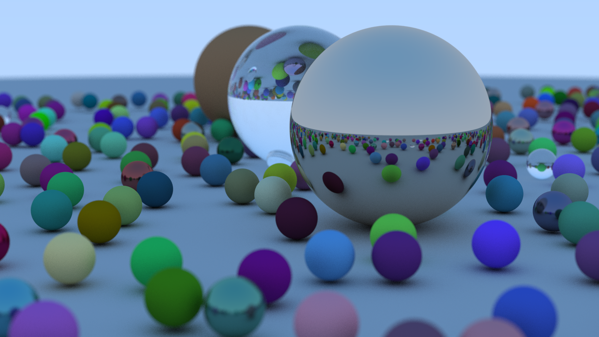

# Raytracing in one weekend

Go implementation of the Raytracing in one weekend book.

This was really fun! This version is single threaded but it's trivial to use channels and goroutines to make use of more cores.

And here's the image created by this program

